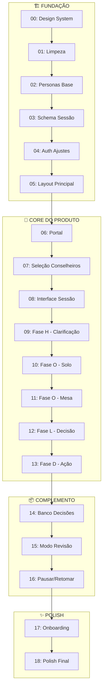

# 🗺️ Planejamento Master — HoldAI

> Roadmap de alto nível das fases de implementação.
> **Última atualização:** 30/01/2026

---

## 📊 Visão Geral do MVP

---

## 🏗️ Bloco 1: FUNDAÇÃO

| Fase | Nome | Skills | Objetivo |
|------|------|--------|----------|
| 00 | Design System | `ui-ux-pro-max`, `tailwind-patterns` | Tokens CSS + componentes base |
| 01 | Limpeza | — | Remover código não utilizado |
| 02 | Personas Base | `ai-engineer`, `prompt-engineering` | 5 personas pré-definidas |
| 03 | Schema Sessão | — | Estrutura de dados Firebase |
| 04 | Auth Ajustes | — | Verificar auth existente |
| 05 | Layout Principal | `frontend-design` | Sidebar simplificada |

**Entregável:** Base sólida para implementar fluxo HOLD.

---

## 🎯 Bloco 2: CORE DO PRODUTO

| Fase | Nome | Skills | Objetivo |
|------|------|--------|----------|
| 06 | Portal | `frontend-design` | Seleção de modo (Solo/Mesa/Revisão) |
| 07 | Seleção Conselheiros | `ui-ux-pro-max` | UI para escolher conselheiros |
| 08 | Interface Sessão | `react-patterns` | Chat + indicadores de fase |
| 09 | Fase H | `ai-engineer` | Moderador + clarificação |
| 10 | Fase O (Solo) | `prompt-engineering` | 1 conselheiro + moderador |
| 11 | Fase O (Mesa) | `prompt-engineering` | 2 conselheiros debatendo |
| 12 | Fase L | `ai-engineer` | Síntese + decisão |
| 13 | Fase D | — | Ação + prazo + encerramento |

**Entregável:** Fluxo HOLD completo funcionando.

---

## 📦 Bloco 3: COMPLEMENTO

| Fase | Nome | Skills | Objetivo |
|------|------|--------|----------|
| 14 | Banco Decisões | `react-patterns` | Histórico + filtros |
| 15 | Modo Revisão | `ai-engineer` | Revisar decisões passadas |
| 16 | Pausar/Retomar | — | Sessões pausáveis |

**Entregável:** Ciclo completo de decisão + revisão.

---

## 🗂️ Bloco 3.5: CRM DE DECISÕES

| Fase | Nome | Skills | Objetivo |
|------|------|--------|----------|
| 16.5 | CRM Base | `react-patterns`, `ui-ux-pro-max` | North Star + Projetos + Kanban |

**O que entra nesta fase:**
- Schema: entidades `NorthStar` e `Project`
- Vinculação: decisão → projeto
- Kanban: 4 colunas fixas (Em Debate / Decidido / Em Maturação / Auditado)
- UI: Cards clicáveis, visualização simples, sem drag-and-drop
- Criação: Projetos simples + 1 North Star por usuário

**Entregável:** Visualização estruturada de todas as decisões.

---

## ✨ Bloco 4: POLISH

| Fase | Nome | Skills | Objetivo |
|------|------|--------|----------|
| 17 | Onboarding | `frontend-design`, `ui-ux-pro-max` | Onboarding ultra premium (menciona CRM) |
| 18 | Polish Final | — | Animações + refinamentos |

**Entregável:** MVP 1.0 pronto para launch.

---

## 📅 Estimativas

| Bloco | Fases | Estimativa |
|-------|-------|------------|
| Fundação | 00-05 | 3-4 dias |
| Core | 06-13 | 5-7 dias |
| Complemento | 14-16 | 2-3 dias |
| Polish | 17-18 | 2-3 dias |
| **Total** | **19 fases** | **12-17 dias** |

> Estimativa conservadora. Pode variar com bugs e refinamentos.

---

## 📎 Referências

| Documento | Descrição |
|-----------|-----------|
| `task.md` | Tasks detalhadas por fase |
| `regras_decisoes.md` | Regras de negócio |
| `design_system.md` | Tokens e UI |
| `definicao_fluxo.md` | Fluxo HOLD + Mesa |
| `definicao_personas.md` | Prompts das 5 personas |
| `implementacoes.md` | Lista de funcionalidades |

---

## 🚀 MVP 2.0 (Pós-MVP 1.0)

### CRM Inteligente

| Feature | Descrição | Requisito Técnico |
|---------|-----------|-------------------|
| **Auditor de Conflitos** | IA cruza decisões de projetos diferentes | Lógica de comparação |
| **Score de Coerência** | Dashboard com métricas de comportamento do founder | — |
| **Zombie Killer** | IA cobra decisões paradas em "Decidido" há muito tempo | Cron job |
| **Integrações Métricas** | Stripe/RevenueCat (apenas Pro) | API |

### Funcionalidades Avançadas

| Feature | Descrição | Requisito Técnico |
|---------|-----------|-------------------|
| Mesa Completa | 4 conselheiros + moderador | — |
| Modo Impasse | Fluxo para decisões travadas | — |
| Check-in Estratégico | Revisão periódica de padrões | — |
| Push Notifications | Lembretes via browser | — |
| Personas Customizadas | Criar novas personas do zero | — |
| **IA Proativa (Histórico)** | Moderador cita decisões passadas espontaneamente | **Vector DB (Pinecone/pgvector)** |
| **Busca Semântica** | Encontrar decisões relacionadas automaticamente | **Vector DB** |
| Integrações Export | Notion/Slack (copiar Memo) | API |

---

> **Última atualização:** 30/01/2026
